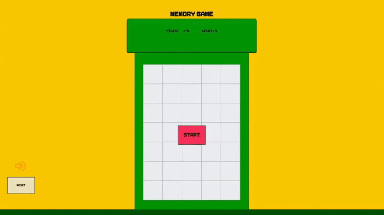

# 🕹️ Memory Game

A simple game inspired by Nintendo to test your memory

[
<kbd>
🎯 Try Out Game
</kbd>](https://strawberrie68.github.io/memory-game/)

## 👩‍💻 How It's Made:

**Tech used:** HTML, CSS, JavaScript, 

Just plain Javascript

## 🏸 Optimizations

Use a framework
We could have used a framework and an organization system to have the code cleaner

## 📝 Lessons Learned:

Making games are very different compared to making apps. 

In-game making there are more different types of puzzles you may have to think through.

Very fun but probably would need to write cleaner code next time

## 👩‍💻 To try the project

Go to Link

[
<kbd>
🎯 Try Out Game
</kbd>](https://strawberrie68.github.io/memory-game/)

